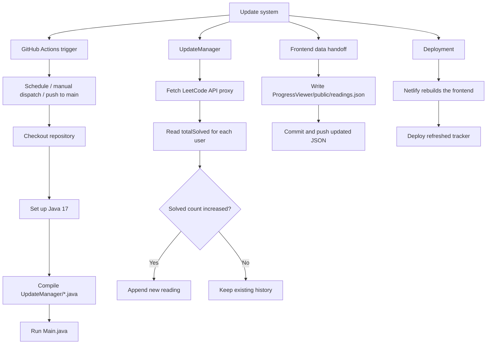

# Auto-Updating Leetcode Progress Tracker

This repository tracks LeetCode solve counts for a small set of accounts and turns them into a time-series dashboard. The important idea is that the site does not compute progress live in the browser. Instead, a GitHub Action periodically runs a Java updater, writes the newest readings into `ProgressViewer/public/readings.json`, commits that file back to the repository, and Netlify serves the site from that updated artifact.

The original use case was comparing progress with [Munis](https://github.com/muniss950), but the structure now supports tracking several friends at once.

## How it works

The repo has two moving parts:

1. `UpdateManager/` is the data collection side.
2. `ProgressViewer/` is the static UI that reads the generated JSON and renders charts.

The browser never talks directly to LeetCode. It only fetches `/readings.json`, which is the file produced by the updater.

### Update pipeline

1. `.github/workflows/update.yml` runs on a schedule, on manual dispatch, and on pushes to `main`.
2. The workflow checks out the repository and sets up Java 17.
3. It compiles the Java files in `UpdateManager/` and runs `Main`.
4. `Main.java` fetches each tracked user from the LeetCode API proxy, extracts `totalSolved`, compares it with the latest stored reading, and appends a new entry only when the count increases.
5. `ReadingsFile.java` loads and saves `ProgressViewer/public/readings.json`.
6. The workflow commits the updated JSON back to `main`.
7. Netlify rebuilds the site from the updated repository contents and serves the refreshed chart.



The repository currently deploys through Netlify, not GitHub Pages. If the hosting target changes later, the last two nodes in the diagram are the only ones that need to change.

### What the Java code does

`UpdateManager/Main.java` is the entry point. It loops over the configured usernames, fetches their data, retries on failures, and waits between requests so the API is not hit too aggressively.

`LeetCodeApi.java` is a small wrapper around the API endpoint. It fetches each profile JSON and extracts the `totalSolved` field.

`HttpTextFetcher.java` is the low-level HTTP client used by the updater. It handles timeouts and turns non-200 responses into useful errors.

`ReadingsFile.java` is responsible for loading and saving the JSON history. It also makes sure every tracked user has a key in the file so the UI always receives a consistent shape.

`Reading.java` is the simple data container used for each history point, and `TimeUtils.java` provides timestamp helpers for writing and formatting values.

### What the UI does

`ProgressViewer/src/App.tsx` is the main React component. It fetches `/readings.json`, converts the stored `[solvedCount, timestamp]` pairs into chart points, and renders the line chart with controls for:

1. time-range filtering,
2. custom duration windows,
3. drag selection on the chart,
4. and optional delta lines between two users.

`ProgressViewer/src/main.tsx` only boots React, and `ProgressViewer/src/index.css` is just the styling entry point.

The UI is intentionally static. It becomes current only when the workflow updates `readings.json` and that file is redeployed.

## Local development

The project is not primarily designed as a local-first app, but you can still work on it locally:

1. Install dependencies in `ProgressViewer/` and run the Vite dev server for the UI.
2. Compile and run the Java updater if you want to refresh `readings.json` manually.

Typical commands:

```bash
cd ProgressViewer
npm install
npm run dev
```

```bash
cd UpdateManager
javac *.java
java Main
```

## Deployment

The deployed site is available at <https://battle.anga.codes>.

The deployment model is deliberately simple: the repository stores the historical readings, the workflow updates that history, and Netlify serves the built static app from the latest commit.

## Repository layout

- `ProgressViewer/public/readings.json`: generated history consumed by the UI.
- `ProgressViewer/src/App.tsx`: charting and interaction logic.
- `UpdateManager/Main.java`: updater entry point.
- `UpdateManager/LeetCodeApi.java`: API fetch and parse wrapper.
- `UpdateManager/ReadingsFile.java`: JSON load/save logic.
- `.github/workflows/update.yml`: scheduled update job.
